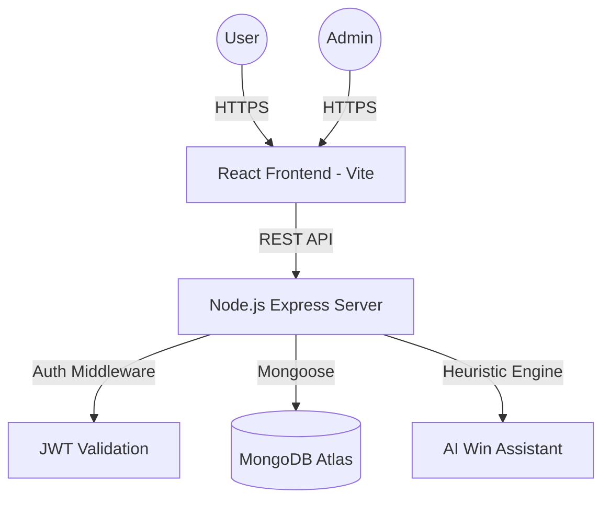

# StakersHub | Premium Football Betting Platform ⚽

StakersHub is a high-performance, immersive sports betting platform designed to deliver a "Stadium-in-your-Pocket" experience. Built for the modern bettor, it combines real-time match analytics, secure role-based management, and a premium glassmorphic interface.


## 🌟 Key Features

### 🏟️ Immersive Arena (Frontend)
- **Stadium Theme**: A dark, high-contrast UI with emerald accents and glassmorphic effects for a premium feel.
-   **AI Win Assistant**: Admin-only AI tool for match analysis and odds recommendation.
-   **Multi-Bet Slip**: Build complex accumulators with real-time payout calculation.
-   **Instant Settlements**: Automated winning payouts upon match conclusion.

### 💰 Robust Betting Engine (Backend)
- **Atomic Transactions**: Secure placement of bets with automatic balance validation and deduction using MongoDB transactions.
- **Automated Settlement**: Admin-triggered match settlement that automatically calculates winnings and credits user wallets.
- **Role-Based Access**: Distinct flows for standard Users and Platform Administrators.

### 🛡️ Secure Infrastructure
- **JWT Authentication**: Secure login and registration with token-based session management.
- **Transaction History**: Full audit trail of stakes, winnings, and wallet movements.

## 🛠️ Tech Stack

- **Frontend**: React 19 (Vite), Framer Motion (Animations), Lucide React (Icons), Axios.
- **Backend**: Node.js, Express.js.
- **Database**: MongoDB with Mongoose ODM (Atomic Transactions).
- **Auth**: JWT & Bcrypt (Role-Based Access Control).

## 🏗️ System Architecture



## 🚀 Getting Started

### Prerequisites
- Node.js (v14+)
- MongoDB (Local or Atlas)

### Installation

1. **Clone the repository**
   ```bash
   git clone <repository-url>
   cd StakersHub
   ```

2. **Setup the Server**
   ```bash
   cd server
   npm install
   ```
   Create a `.env` file in the `server` directory:
   ```env
   PORT=6000
   MONGO_URI=mongodb://localhost:27017/stakersdb
   JWT_SECRET=your_super_secret_key
   ```

3. **Seed Initial Matches**
   ```bash
   node seed.js
   ```

4. **Launch the Arena**
   ```bash
   # In the server directory
   npm start
   
   # In the client directory
   npm install
   npm run dev
   ```

## 🤖 AI Win Assistant (Admin Only)
The StakersHub AI engine analyzes historical team form, league standings, and home/away advantages to suggest mathematically sound odds. 
- **Probability Mapping**: Get percentage-based win/draw/loss forecasts.
- **Auto-Odds**: Suggested odds are automatically calculated with a 10% market margin.
- **Form Analysis**: Textual summary of team performance metrics.

## 🎮 How to Use

### For Players
1. **Join the Hub**: Register and receive an instant KES 1,000 sign-up bonus.
2. **Select Odds**: Browse matches and click on Home (1), Draw (X), or Away (2) to add to your slip.
3. **Place Bet**: Enter your stake in the sidebar and confirm.
4. **Track Wins**: Check "My Bets" to see active slips and settled winnings.

### For Admins
1. **Login**: Access your admin-privileged account.
2. **Dashboard**: Navigate to the "Admin" link in the header.
3. **Settle Markets**: Select the final result of a match to trigger instant global payouts.

## 📁 Project Structure

```text
StakersHub/
├── client/              # React Frontend
│   ├── src/
│   │   ├── components/ # React Components
│   │   ├── context/    # Global State (Auth, BetSlip)
│   │   ├── App.jsx     # Main Router & Layout
│   │   └── index.css   # Premium Design System
│   └── index.html      
├── server/              # Node.js Backend
│   ├── config/         # DB & Environment
│   ├── models/         # Mongoose Schemas
│   ├── routes/         # API Endpoints
│   └── server.js       # Entry Point
└── README.md
```

---
*Built with ❤️ for the Kenyan Staking Community.*
